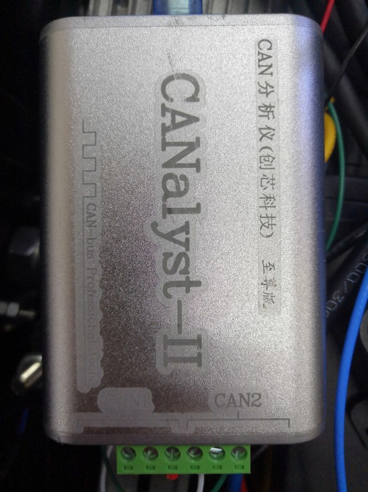
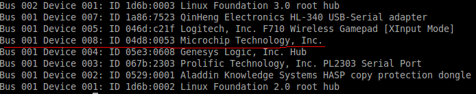
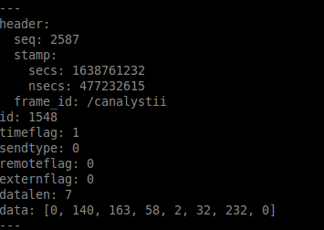

# ARS_408_Radar
德国大陆ARS_408毫米波雷达测试
- 系统版本：ubuntu14.04
- CAN分析仪：创芯科技CANalyst-II至尊版


毫米波雷达不带电阻，需要外接一个CAN接口，电阻调到错开位置。之后接到电脑上就可以查看使用了。
记录一下使用过程中出现的问题。

## 1. CAN接口不支持linux
毫米波雷达厂家赠送的CAN接口型号为创芯科技CANalyst-II至尊版。


经过两天的学习发现，创芯科技的CAN接口不论怎么样都无法在linux上识别为can设备。arx_40x的驱动无法运行can接口打不开。后来发现创芯科技单独出过一个CAN分析仪linux版。
又与技术进行沟通，最终确认这款CAN分析仪不支持linux。

## 2. 驱动编译
驱动无法安装，只能另辟蹊径。实验发现ESR雷达使用usb接口进行通讯，将esr雷达驱动拿过来，可以正常使用。
步骤
### 1. 修改usb权限
插入usb后
```shell
lsusb  # 查看usb接口
```


在
`/etc/udev/rules.d`目录下新建一个`99-myusb.rules`的文件
内容为：
```shell
ACTION=="add", SUBSYSTEMS=="usb", ATTRS{idVendor}=="04d8", ATTRS{idProduct}=="0053", GROUP="users", MODE="0777"
```

### 2. 下载驱动
https://github.com/VincentCheungM/ESR_canalyst_ros

```shell
rosrun canalystii_node canalystii_node_ros
```
订阅`rostopic echo /canalyst_can`



拿到的数据都是十六进制转为十进制输出的。
这时只需要订阅该话题，进行数据处理就行了。如果需要更改雷达功率，ID,输出类型，需要使用windows电脑参考通讯协议进行配置。

